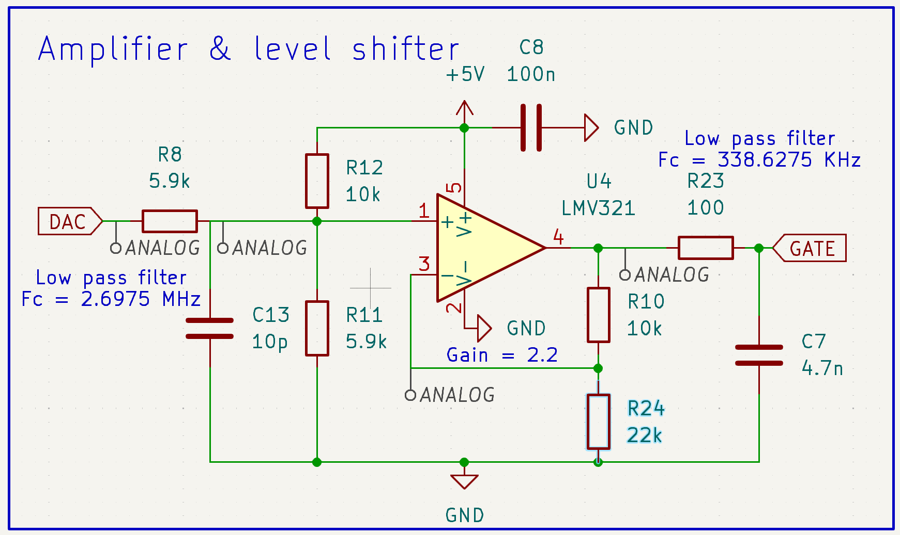

# Pocker Power Prowler

**Note: this is still very much a work in progress, and next version will bring considerable improvements over the current one.**

Pocket Power Prowler is a tiny programmable constant current dummy load with voltage and current sensors for test device's power supply, as well as its output under test.

It is programmable via USB using a simple text-based protocol, and [in the future](https://github.com/mmalecki/Pocket-Power-Prowler/issues/4)), the [SCPI protocol](https://en.wikipedia.org/wiki/Standard_Commands_for_Programmable_Instruments).

It is based on the [ATtiny814 Power Analyzer](https://github.com/wagiminator/ATtiny814-Power-Analyzer) by [@wagiminator](https://github.com/wagiminator/ATtiny814-Power-Analyzer).
If you're interested in how the project changed, check out the [changelog](CHANGELOG.md).

The overarching goal of the project is to create a portable, accurate, reliable and safe dummy load.

# Current control
Current control is implemented using the ATtiny814's digital-to-analog converter (DAC), a level-shifting operational amplifier
(OpAmp) as well as [INA219](https://www.ti.com/lit/ds/symlink/ina219.pdf) current sensor connected to a 8mΩ shunt resistor.

While running a test, software on the ATtiny constantly compares the desired current set by user with current reported by
the sensor, and makes adjustments to the DAC output as necessary, in turn controlling the gate voltage of a
[IRL540N](https://datasheet.lcsc.com/lcsc/1808281632_Infineon-Technologies-IRL540NPBF_C111607.pdf) logic level
power MOSFET, which adjusts its resistance, therefore changing the current flowing and being dissipated through it.

## DAC and OpAmp

The resistor values (for gain and voltage offset) were picked so that when ATtiny outputs 0 V on its DAC output,
the voltage at the gate of MOSFET is just below its turning on point (VGS), and when ATtiny outputs the full
DAC voltage at our picked reference point (1.5 V), the MOSFET is conducting the full amount of current we're
equipped to handle (5 A). In short, we're looking for the (almost entire) range of the DAC to cover the (almost entire)
ohmic region of the MOSFET.

## Current sensor and current control loop
On a set interval (currently 5 ms), the ATtiny reads current levels from the load-side INA219 sensor, compares them to set value
and reacts accordingly if the current differs from the setpoint.

This is necessary due to inherently nonlinear characteristics of any MOSFET, changing with voltages, currents and temperatures affecting it.

## Compiling and Uploading the Firmware

### If using the makefile (Linux/Mac)
- Connect your [programmer](https://github.com/wagiminator/AVR-Programmer) (jtag2updi or SerialUPDI) to your PC and to the UPDI header on the board.
- Make sure you have installed the latest [avr-gcc toolchain](http://maxembedded.com/2015/06/setting-up-avr-gcc-toolchain-on-linux-and-mac-os-x/).
- Open a terminal.
- Navigate to the folder with the makefile and the sketch.
- Run `DEVICE=attiny814 PROGRMR=serialupdi PORT=/dev/ttyUSB0 make install` to compile, burn the fuses and upload the firmware (change DEVICE, PROGRMR and PORT accordingly).

# Operating Instructions
The device can be operated in two ways:
- Using a serial monitor: Test algorithms can be started by sending the corresponding command via a serial monitor. The collected data will be displayed in the serial monitor and can be exported to a spread sheet program for further analysis.
- Using the [web app](...). This is the easy way. Everything should be self-explanatory. All following example pictures are created by this application.

## **Load Test**

- Command: "l  *maxloadcurrent[mA: 0..5000]* *minloadvoltage[mV: 0..26000]*"
- Example: "l 2500 4200"
- Prowler continuously increases the load from 0 mA up to *maxloadcurrent*. It stops automatically if the voltage drops below *minloadvoltage*. It continuously transmits the measured values via the serial interface in the format: `current[mA] voltage[mV] power[mW]` (seperated by the `SEPERATOR` character).

## **Voltage Regulation Test**

- Command: "g *maxloadcurrent[mA: 17..5000]*"
- Example: "g 3000"
- The Power Analyzer changes rapidly the load between 17 mA and *maxloadcurrent*. It continuously transmits the measured values via the serial interface in the format: time[ms] current[mA] voltage[mV] (seperated by the SEPERATOR string).

## **Efficiency Test**

- Command: "e  *maxloadcurrent[mA: 17..5000]* *minloadvoltage[mV: 0..26000]*"
- Example: "e 4000 2500"
- The Power Analyzer continuously increases the load from 17 mA up to *maxloadcurrent*. It stops automatically if the voltage at TEST-IN drops below *minloadvoltage*. It continuously transmits the measured values via the serial interface in the format: current[mA] voltage[mV] efficiency[% * 10] (seperated by the SEPERATOR string).

## **Battery Discharge Test**

- Command: "b  *maxloadcurrent[mA: 17..5000]* *minloadvoltage[mV: 0..26000]*"
- Example: "l 1000 2700"
- The Power Analyzer sets a constant current load of *maxloadcurrent*. If the voltage drops below *minloadvoltage* it constantly decreases the load to maintain *minloadvoltage*. It stops automatically if the load current drops to 0mA. It continuously transmits the measured values via the serial interface in the format: time[s] current[mA] voltage[mV] capacity[mAh] (seperated by the SEPERATOR string).

## **Long-Term Multimeter**

- Command: "m  *interval[ms: 2..65535]* *duration[s: 1..65535]*"
- Example: "m 18000 18000"
- The Power Analyzer measures voltage, current and power delivered to the test device at every *interval* for a total of *duration*. It continuously transmits the measured values via the serial interface in the format: time[ms] current[mA] voltage[mV] (seperated by the SEPERATOR string).

## **Commands for Direct Control**
|Command|Function|
|-|-|
|"i"|transmits indentification string ("Power Analyzer")|
|"v"|transmits firmware version number|
|"x"|terminate current test program, reset load to minimum|
|"s *loadcurrent[mA]*"|set load to a constant current of *loadcurrent*|
|"t"|read current and voltage of both sensors and transmit them|

# Notes
- Use a good heatsink with a fan for the MOSFET! Attach a 10K 3977B or 3950B (configurable in code) NTC thermistor to the heatsink close to the MOSFET!
- Be careful with high power loads! Make some tests to figure out what can be achieved with your cooling solution!
- The maximum load current is 5A, however for small voltages it might be less.
- The maximum PWR-IN/PWR-OUT current is 8A.
- Do not exceed the maximum voltage of 26V on all connectors!
- In order to make the design much simpler all connectors including USB share a common ground. Keep this in mind when making your test setup in order to avoid ground loops or shorts. Using a [USB isolator](https://github.com/wagiminator/ADuM3160-USB-Isolator) between the Analyzer and your PC is not a bad idea!
- You need a UPDI programmer for uploading the firmware. You can find one in my [projects](https://github.com/wagiminator/AVR-Programmer) or you can easily build one following this [guide](https://github.com/SpenceKonde/AVR-Guidance/blob/master/UPDI/jtag2updi.md).

# License

This work is licensed under Creative Commons Attribution-ShareAlike 3.0 Unported License. 
(http://creativecommons.org/licenses/by-sa/3.0/)
